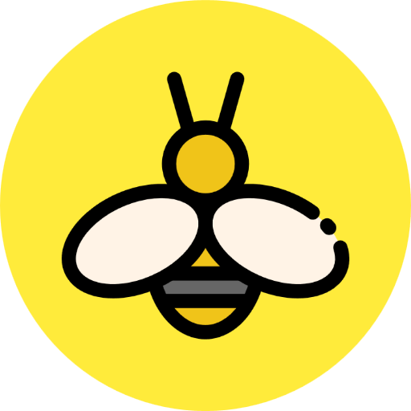
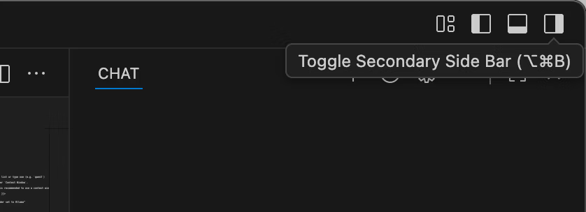
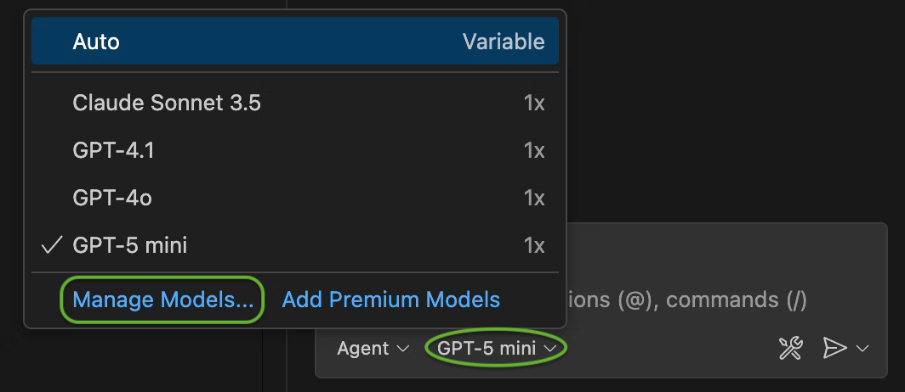

<div align="center">

</div>
<div align="center">
BeeCoder
</div>
<div align="center">
<small>VSCode Copilot Pollinations Bridge</small>
</div>

## Install

```sh
npm install -g beecoder
```

## Setup

1. Start server.
```sh
beecoder start
```
Or run in the background process: `beecoder start &`

2. Open **Copilot** side bar found in top right window


3. Select the **model drowpdown** > **Manage** models


4. Enter **Ollama** under **Provider Dropdown** and select desired models.

### Pollinations Token
Create a token: [enter.pollinations.ai](https://enter.pollinations.ai/). Then create a file named `.beecoder` in your home directory and paste your token into it.

```sh
cd $HOME
echo "TOKEN" > .beecoder
```

### Development
```sh
# install dev dependencies.
npm install

# start server
npm start

# test cli
npm run build
npm link
beecoder -v
```